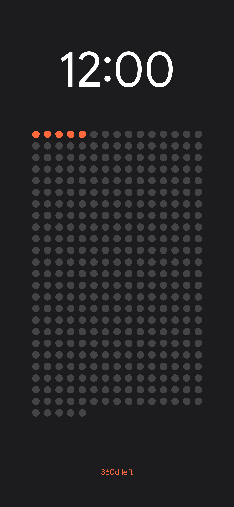

Time is linear. Your perception of it shouldn't be.

I built a Python script that draws circles. It runs on a server you don't own, updates while you sleep, and generates a visualisation of the only non-renewable resource you have: **Time.**

It’s minimalist. It’s automated. It’s better than your calendar.

## 👁️ The Witness

This image updates every night at **00:00 IST**. You don't have to do anything. It just happens.



## 🎨 The Chroma Key

We used colors. You like colors.

* ⚪ **White:** The Past. It's gone. Get over it.
* 🟠 **Orange:** The Present. You are here. Panic accordingly.
* 🟡 **Yellow:** The Special Ones. Birthdays? Anniversaries? The day you finally quit your job? We marked them.
* ⚫ **Gray:** The Future. It hasn't happened yet. Don't worry about it.

## 📲 The Integration

Widgets are for amateurs. You want this as your **Wallpaper**.

We made an iOS Shortcut that fetches the grid and sets it as your background automatically. It’s cleaner. It’s faster. It’s better.

### Step 1: Get the Tool
Download the shortcut. It does the heavy lifting so you don't have to.

👉 **[Download the Shortcut](https://www.icloud.com/shortcuts/8963d7263edd4c3c8ca6543e52d2b260)**

### Step 2: Automate It
You have an iPhone. Make it work for you.

1.  Open the **Shortcuts** app.
2.  Go to the **Automation** tab at the bottom.
3.  Tap **New Automation** (or the **+** icon).
4.  Select **Time of Day**. Pick a time (e.g., **06:00 AM**). Select **Daily**.
5.  Select **Run Immediately**. (Don't let it ask you. Just let it run.)
6.  Tap **Next**.
7.  Search for **The Grid** shortcut you just downloaded and select it.

**Done.**

Now, every morning at 6 AM, your phone wakes up, grabs the new grid, and updates your reality before you even open your eyes.

## 🚀 Manual Deployment

Wanna do it the hard way?

1.  **Steal the URL:**
    ```
    [https://the-rebooted-coder.github.io/The-Grid/daily_status.png](https://the-rebooted-coder.github.io/The-Grid/daily_status.png)
    ```
2.  **Paste it:** Use it in any widget app, dashboard, or browser tab.
3.  **Forget it:** We handle the updates.

## 🛠️ Under the Hood

It's not magic. It's `Pillow` and `GitHub Actions`.

* **Engine:** Python 3.12 (The good one).
* **Schedule:** 18:30 UTC (That's midnight in India. Do the math).
* **Hosting:** GitHub Pages. Free real estate.

## ⚙️ Customization

"But I want *my* special dates."

You don't need to touch the code. We made it idiot-proof.

1.  **Fork** this repository.
2.  Go to **Settings** (Tab at the top).
3.  Go to **Secrets and variables** → **Actions** → **Variables** (Not Secrets).
4.  Create a **New Repository Variable**:
    * **Name:** `SPECIAL_DATES`
    * **Value:** `03-02, 04-29, 12-10`
    *(Format: MM-DD, separated by commas)*.

The next time the clock strikes midnight, your yellow dots will appear.

---
*Built with ☕ and anxiety by GitHub Actions.*
